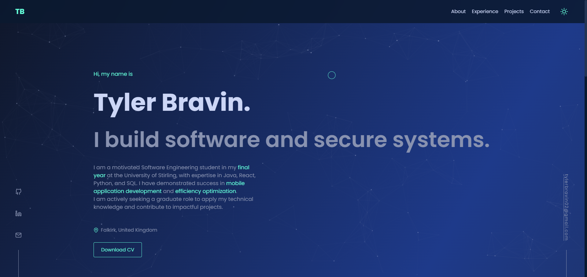

# Personal Portfolio Website


[](https://github.com/tyler-bravin/Portfolio-Website/blob/main/LICENSE)

A modern, responsive personal portfolio website built with **React.js**. It's designed to showcase skills, experience, and projects in a clean and visually engaging way. The site features smooth animations, a dark/light theme toggle, and dynamically fetches project data directly from the GitHub API.

<br>



---

### ✨ Key Features
* **Dynamic Theme Switching**: Easily toggle between a dark and light theme, with your preference saved in local storage.
* **API Integration**: Fetches recent projects directly from the GitHub API, displaying key information like descriptions, technologies, and stats.
* **Responsive Design**: The layout adapts seamlessly to a range of devices, from desktops to mobile phones.
* **Smooth Animations**: Utilizes **Framer Motion** for subtle, professional animations and transitions on page load and scroll.
* **Interactive Background**: A dynamic particle effect creates an engaging visual backdrop.
* **Smooth Scrolling Navigation**: Navigate between sections of the site with a smooth, animated scroll.

---

### 💻 Technologies Used
* **Frontend**: React.js, HTML5, CSS3, JavaScript
* **Styling & Theming**: CSS Custom Properties (Variables), Responsive CSS
* **Animation**: `framer-motion`, `particles.js`
* **Icons**: `react-icons`
* **API Integration**: GitHub REST API
* **Other Libraries**: `react-responsive-carousel` for image slideshows

---

### 🛠️ Installation & Setup

Follow these steps to get a local copy of the project up and running.

1.  **Clone the repository:**
    ```bash
    git clone https://github.com/tyler-bravin/Portfolio-Website.git
    cd Portfolio-Website
    ```

2.  **Install dependencies:**
    ```bash
    npm install
    ```

3.  **Set up Environment Variables:**
    This project requires a GitHub Personal Access Token to fetch repository data.

    * Create a file named `.env` in the root of your project.
    * Add your GitHub token to the file in the following format:
        ```env
        REACT_APP_GITHUB_TOKEN=your_personal_access_token_here
        ```
    > **Note:** Make sure your token has at least the `public_repo` scope to access repository data. For security, never share this file or commit it to your repository. You can follow [GitHub's official guide to create a Personal Access Token](https://docs.github.com/en/authentication/keeping-your-account-and-data-secure/managing-your-personal-access-tokens#creating-a-personal-access-token-classic).

4.  **Start the development server:**
    ```bash
    npm start
    ```
    The application will now be running on `http://localhost:3000`.

### 📜 License
This project is licensed under the MIT License. See the `LICENSE` file for details.